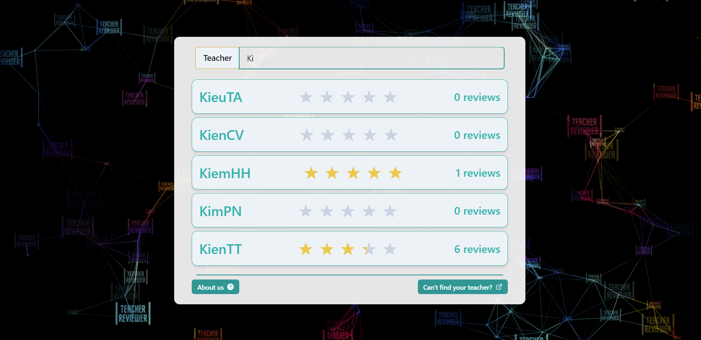
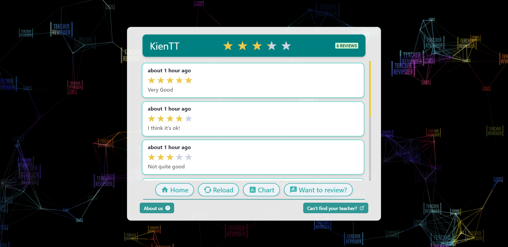
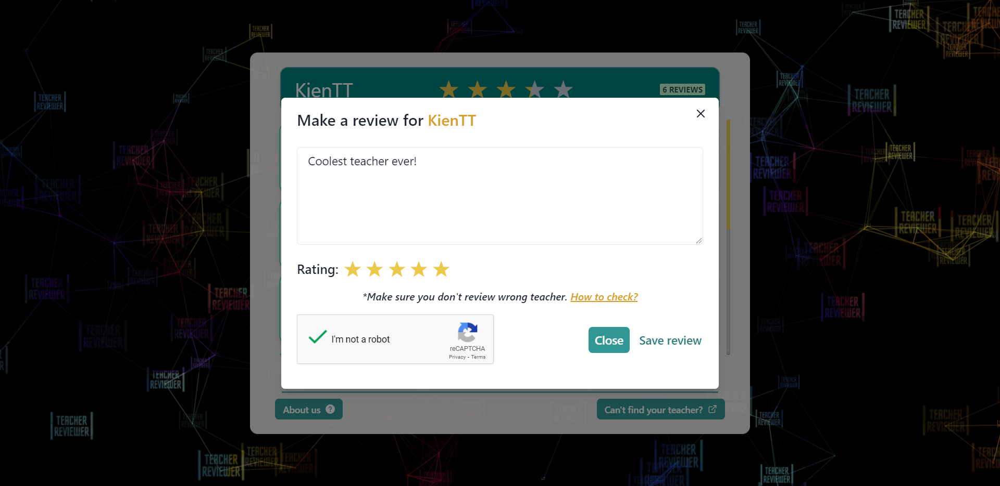
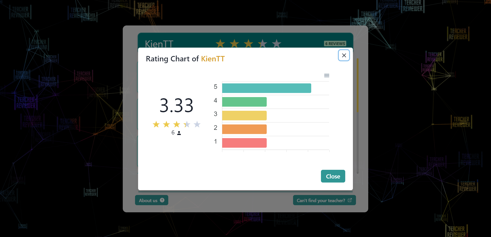

#  Teacher Reviewer

## [Live Demo](https://youtu.be/CCBWVTTRZac) or [Try it here](http://teacher-reviewer.web.app/)

## What is Teacher Reviewer?
- Tired of asking people to find suitable teachers for future semesters?
- Afraid of revealing your identity when asking or reviewing teachers for your friends?
- If that's true, this application is for you!
- This application allows student to refer or review teachers in `incognito` way.
- The statistics of reviews will be visualized with chart for easier to other people to see the overview of the teacher.
- Work well on Desktop and Mobile.

**Note**: This application will automatically re-calculate reviews with 5-10 minutes intervals.

## Technology
- Frontend
  - React - A JavaScript library for building user interfaces
  - Create React App - React starter template
  - Chakra UI - A simple, modular and accessible component library
  - Recoil - A state management library for React
  - Apexcharts.js - Modern & Interactive Open-source Charts
- Backend
  - NestJS - A progressive Node.js framework
  - Class Validator - Validation
  - Typeorm - Object–relational mapping
  - Jest + Supertest - Testing
  - Postgresql - Database

## Some preview images
&nbsp;
&nbsp;

## Available Scripts
- To advoid the complexity of setup client and server, I strongly recommend you to setup with `Docker`
- If you want to run Book Playlist without `Docker` or run separately, read the `README.md` in `client` and `server` folder.
- In the project directory, you can run following commands to setup with `Docker`:

## Start up docker containers
```
yarn start
```

## Shutdown docker containers
```
yarn stop
```

## Setup Pgadmin
- Go to `localhost:16543` and login with `admin@admin.com` and `admin` as username and password respectively.
- Click `Add New Server`
- In General tab, enter name of the database server (this is just an abstract name so you can name it anyname you want).
- In Connection tab, enter `postgresql`, `task_management`, `username` and `password` as host, database, username and password.
- Leave all other fields as default value then click `Save`.
=> That's all, you are connected to database in your local container. Try to explore with Pgadmin more and have fun. 

# License & copyright

© Kirin Tran, FPT University TP.HCM
Licensed under the [MIT LICENSE](LICENSE).
